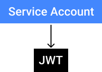

<div align="center">
  
  <br>
  <br>
  <a href="https://github.com/tomchinery/gcp-service-account-jwt-generator/blob/main/LICENSE">
    
  </a>
  <br>
  <br>
  <p>
  Service Account JWT Generator is a CLI tool that generates a JWT token for Service Account authorization without OAuth on GCP.
  </p>
</div>

> GCP Service Account JWT Generator is an experimental project used for a very specific use case -- it is generally insecure to output Authorization Bearer tokens on the command-line so please use at your own risk!

## Table of contents

* [Contents](#contents)
* [Installation](#installation)
* [Usage](#usage)
* [Usecases](#usecases)
* [References](#references)
* [Contributing](#contributing)
* [License](#license)

## Installation

The CLI is an NPM package:
```bash
$ npm install -g @tomchinery/gcp-service-account-jwt-generator
```

## Usage

Upon running the CLI it will output an Authorization Bearer to STDOUT that is signed with your GCP Service Account.

There is a required argument of the tool:

```bash
$ gcp-service-account-jwt-generator --service-account <path_to_your_service_account>
```

## Usecases

The specific usecase this tool was created was for authenticating against service API's that sit behind IAP (Identity Aware Proxy) on GCP. Specifically I'm using the outputted JWT to request an OIDC token for an IAP-secured client ID. It's the OIDC token that I use to actually authenticate against my services behind IAP. 

## References

> - [Authenticating from a service account](https://cloud.google.com/iap/docs/authentication-howto#iap_make_request-nodejs)
> - [Addendum: Service account authorization without OAuth](https://developers.google.com/identity/protocols/oauth2/service-account#jwt-auth)
> - [Preparing to make an authorized API call](https://developers.google.com/identity/protocols/oauth2/service-account#java)

## Contributing

I imagine this tool could be useful for a number of other usecases. Please if you do contribute feel free to add to the Usecases section in the README.md. 

All PR's or feedback is welcome - I normally have a lagg time of about 72 hours on reviews or issues so don't panic if you don't get a response straight away.

## License

[Unlicense](https://github.com/tomchinery/gcp-service-account-jwt-generator/blob/main/LICENSE)
